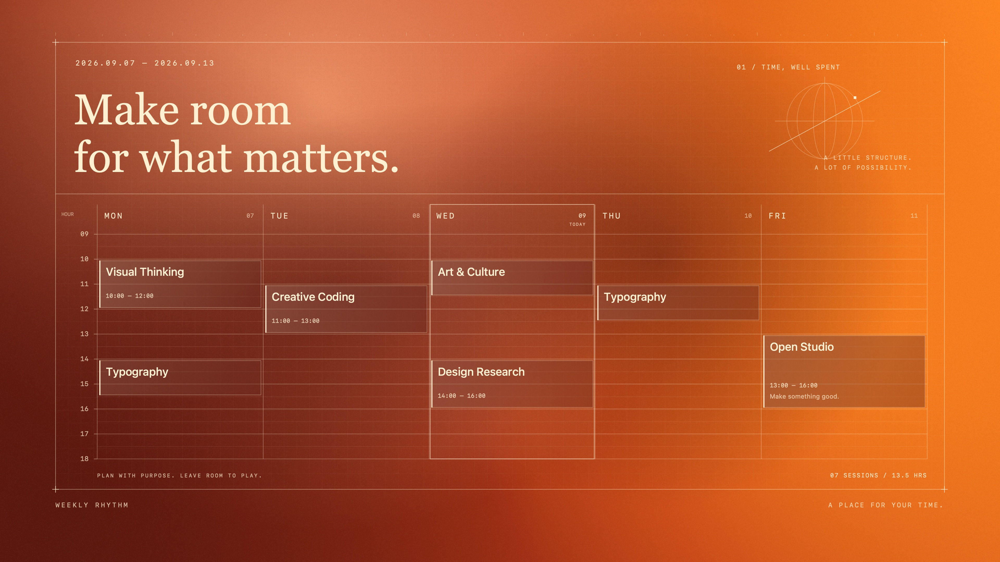
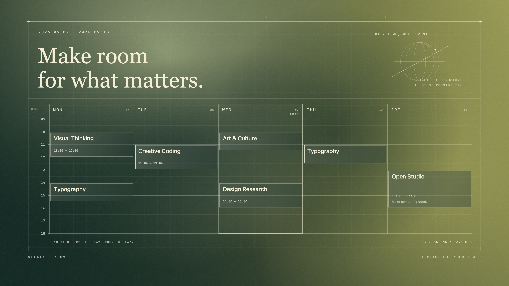
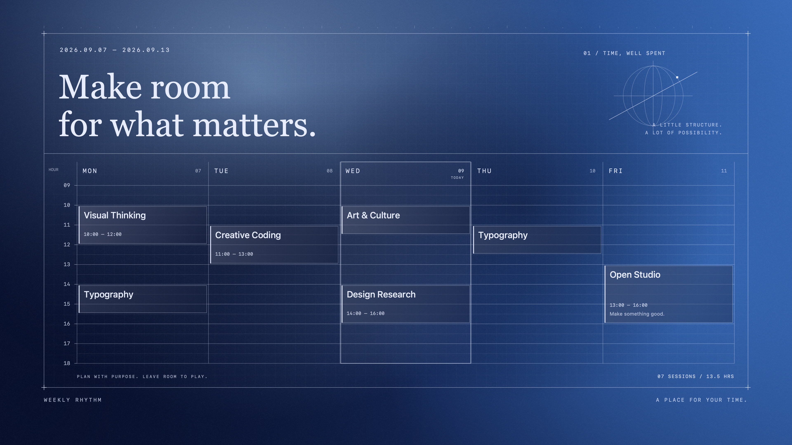
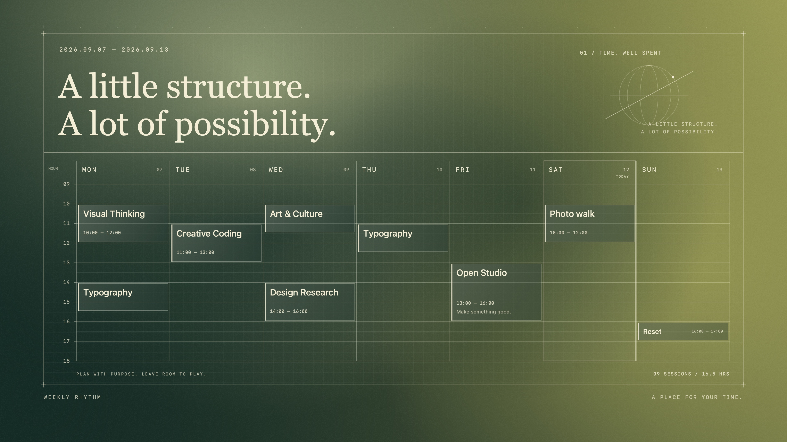
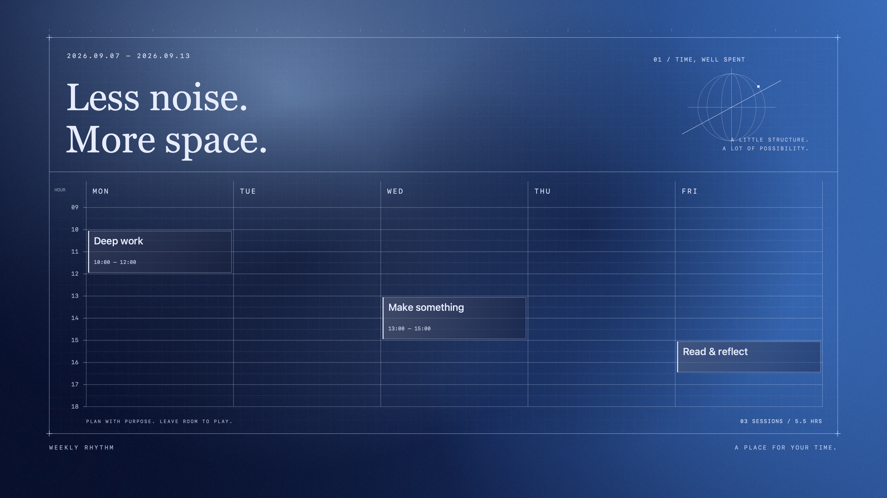
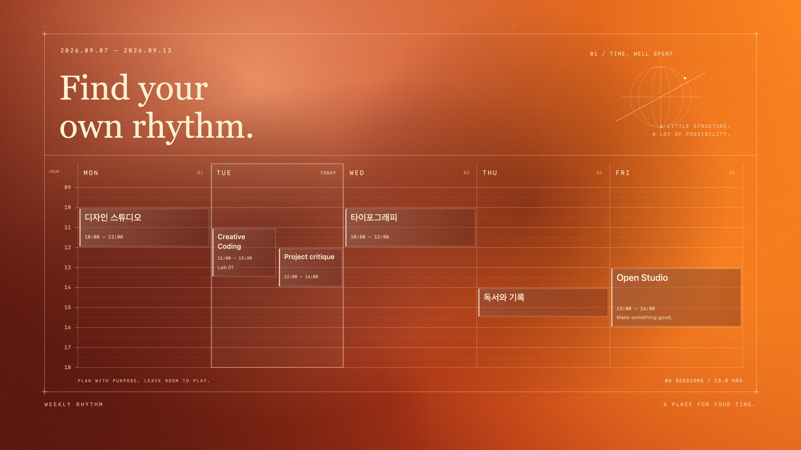

# Serein

**매일 보고 싶은, 나의 한 주.**

[English](README.md) · 한국어

시간표와 캘린더를 나만의 Mac 배경화면으로 만듭니다. 네이티브 macOS 앱에서 이미지의 글자를 읽고, 모든 그래픽을 코드로 그립니다. 생성형 이미지나 API 키가 필요하지 않습니다.

[](docs/images/ember.jpg)

## 내 시간표로 시작하기

| 입력 | 할 수 있는 일 |
| --- | --- |
| 시간표 이미지 | 기기에서 글자를 인식하고, 결과를 확인·수정합니다. |
| 직접 입력한 일정 | 과목·시간·장소와 나만의 문구를 설정합니다. |
| Apple·Google 캘린더¹ | 한 주를 가져오고, 원본을 지우지 않고 원하는 일정만 숨깁니다. |
| 마음에 드는 디자인 | 고해상도 PNG로 저장하거나 모든 데스크탑과 디스플레이에 적용합니다. |

¹ Google 캘린더는 macOS 캘린더 앱에 동기화된 계정을 통해 연결합니다. 앱 화면은 현재 한국어입니다.

## 세 가지 색, 다양한 한 주

위의 **Ember**, 아래의 **Moss**와 **Midnight**. 이 페이지의 이미지는 모두 가상 일정으로 새로 렌더링한 **3840 × 2160** 결과물입니다. 클릭하면 원본 해상도로 볼 수 있습니다.

| Moss | Midnight |
| :---: | :---: |
| [](docs/images/moss.jpg) | [](docs/images/midnight.jpg) |

| 주말까지 한눈에 | 필요한 것만 간결하게 | 겹치는 일정도 나란히 |
| :---: | :---: | :---: |
| [](docs/images/weekend.jpg) | [](docs/images/quiet.jpg) | [](docs/images/overlap.jpg) |

요일 옆 숫자는 실제 일자(`07`, `08`), 순서 번호(`01`, `02`), 표시 안 함 중 고릅니다. 문구·장소 표시·주말 포함도 바꿀 수 있습니다.

## 새로운 한 주를 자동으로

세 옵션을 따로 켜고 끌 수 있습니다. 기본값은 모두 꺼짐입니다.

- **일정 변경 시 교체:** 선택한 캘린더의 이번 주 일정이 바뀌면 반영합니다.
- **매주 새 배경화면:** 월요일에 새 주로 전환하고, 앱이 다시 작동하면 놓친 갱신을 따라잡습니다.
- **오늘 표시:** 날짜에 따라 이동하는 은은한 테두리를 더합니다.

숨긴 반복 일정은 동기화와 다음 주에도 숨김을 유지합니다. 창을 닫아도 메뉴 막대에서 작동하며, 앱을 종료하면 갱신이 멈춥니다. 로그인 시 실행은 선택 사항입니다.

## 내 Mac에서 실행하기

**macOS 14 이상**, **Swift 5.10 이상**, Apple **Command Line Tools**가 필요합니다. 외부 패키지 의존성은 없습니다.

```sh
git clone https://github.com/era-s/serein.git
cd serein
./scripts/build-app.sh
open dist/Serein.app
```

직접 빌드하는 방식이며 **Apple 공증을 받은 배포판은 아닙니다**. 빌드 스크립트가 로컬 서명 인증서를 만들고 재사용해 업데이트 시 앱 식별을 유지합니다. [빌드 설명과 검증 →](docs/DEVELOPMENT.md)

## 내 Mac 안에서

OCR은 Apple Vision으로 처리합니다. Serein은 이미지나 시간표를 서버에 업로드하지 않습니다. macOS 권한 이름은 ‘전체 접근’이지만 앱은 캘린더를 읽기만 합니다. 각 캘린더 서비스의 계정 동기화는 별도로 작동합니다.

OCR 결과는 적용 전에 확인해주세요. 모든 Space 적용은 백업과 버전 확인을 거쳐 macOS 배경화면 저장 형식을 갱신하므로, 향후 macOS 변경에 대응이 필요할 수 있습니다. PNG 저장도 사용할 수 있습니다.

[상세 사용 가이드](docs/guide.ko.md) · [개발 기록](docs/devlog.md) · [공개 전 개인정보 검토](docs/publication-review.md)
