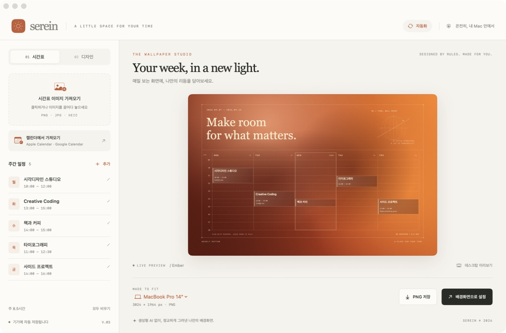
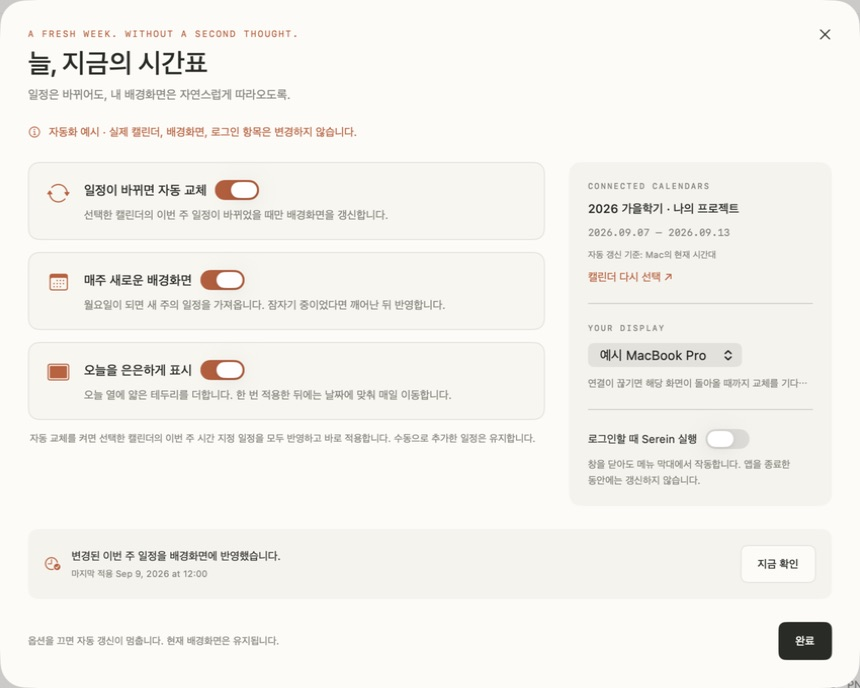

# Serein

시간표를 매일 보고 싶은 Mac 배경화면으로. **이미지·직접 입력·캘린더 → 확인·수정 → 결정론적 렌더링 → PNG 저장 / 배경화면 적용**으로 이어지는 네이티브 macOS 앱입니다.



## 실행

macOS 14 이상, Swift 5.10 이상이 필요합니다. 외부 패키지나 API 키 없이 Apple의 기본 프레임워크만 사용합니다.

```sh
./scripts/build-app.sh
open dist/Serein.app
```

생성된 `Serein.app`을 응용 프로그램 폴더로 옮겨 사용할 수도 있습니다. 개발 빌드는 이 Mac의 지속되는 인증서로 서명하며 Apple 공증된 배포판은 아닙니다. 빌드마다 앱 식별이 달라져 캘린더 권한이 끊기던 ad-hoc 서명은 사용하지 않습니다.

첫 빌드에서 `~/Library/Application Support/SereinDevelopmentSigning/identity`에 전용 개발 인증서와 잠긴 키체인을 만들고 이후 빌드에 재사용합니다. 개인키·키체인 암호는 저장소에 넣지 않습니다. 이 디렉터리를 삭제하면 다음 서명의 식별이 바뀌므로 업데이트용으로 보존하세요. 시스템 인증서 신뢰 설정은 변경하지 않으며 빌드 중 추가한 키체인 검색 항목은 종료 시 제거합니다. 기존 Apple 개발 인증서가 있으면 `SEREIN_SIGN_IDENTITY`와 선택적으로 `SEREIN_SIGN_KEYCHAIN`을 지정할 수 있습니다.

## 사용법

1. 왼쪽 **시간표 이미지 가져오기**를 누르거나 PNG/JPG/HEIC 이미지를 끌어다 놓습니다. **추가**로 직접 입력할 수도 있습니다.
2. 인식 결과와 원본을 비교하고 과목을 클릭해 이름·요일·시작/종료 시간·장소를 수정합니다. 원본 이미지는 슬라이더로 최대 3배 확대할 수 있습니다. 확인 체크 후 선택한 일정을 반영합니다.
3. **디자인**에서 Ember, Moss, Midnight 테마와 문구, 학기 제목, 장소 표시, 주말, 텍스처를 설정합니다.
4. MacBook 해상도를 선택하고 **PNG 저장** 또는 **배경화면으로 설정**을 누릅니다. 기본 적용 범위는 **모든 데스크탑과 디스플레이**입니다. Desktop 1·2 등의 가상 데스크탑(Space)에도 같은 이미지가 적용됩니다.

일정은 클릭해서 수정합니다. 직접 입력한 일정은 삭제하며, 캘린더 일정은 **배경화면에서 숨기기**로 제외합니다. 숨김은 동기화 뒤에도 유지합니다. 겹치는 일정은 같은 칸 안에 나란히 배치됩니다. 시간 범위와 주말은 입력 일정에 맞춰 자동 확장됩니다. 데스크탑 미리보기의 메뉴 막대와 Dock은 미리보기에만 표시됩니다.

## Apple Calendar · Google Calendar

왼쪽 **캘린더에서 가져오기**(⌘K)에서 연결합니다. macOS에 등록된 캘린더를 EventKit으로 읽으며, 별도 Google API 키나 앱 내 OAuth 설정이 필요하지 않습니다.

1. **캘린더 연결**을 누르고 macOS 접근 요청을 허용합니다. 일정을 읽으려면 macOS가 ‘전체 접근’ 권한을 요청하지만, Serein은 일정을 읽기만 하며 원본을 변경하지 않습니다.
2. 사용할 캘린더를 선택하고 기준 날짜를 고릅니다. 가져오는 범위는 표시된 시간대의 월요일부터 일요일까지입니다.
3. **이 주의 일정 가져오기**를 누르고, 가져온 과목의 이름·요일·시간·장소를 검토합니다.
4. 선택한 일정을 반영하고 PNG로 저장하거나 배경화면으로 설정합니다. 선택한 주의 날짜를 배경화면 제목에 표시할 수 있습니다.

**Google 계정이 목록에 없으면:** 시스템 설정 → 인터넷 계정 → Google에서 로그인하고 **캘린더**를 켭니다. Apple 캘린더 앱에 일정이 나타난 뒤 Serein의 목록 새로고침을 누릅니다. [Google 공식 Mac 연결 안내](https://support.google.com/calendar/answer/99358?co=GENIE.Platform%3DDesktop&hl=ko)를 참고하세요. iCloud 계정도 Mac에서 캘린더 동기화가 켜져 있어야 합니다.

[연결 시작 화면](artifacts/calendar-connect.png) · [예시 계정으로 검증한 가져오기 화면](artifacts/calendar-review-demo.png) · [예시 일정으로 만든 배경화면](artifacts/calendar-wallpaper-demo.png)

- 반복 일정은 선택한 주의 실제 회차로 가져옵니다. 자정을 넘는 일정은 날짜별로 나눕니다. 종일 일정·취소·참석 거절 등 제외 항목의 개수를 안내합니다.
- ‘기존 시간표를 이 일정으로 교체’를 끄면 기존 시간표에 병합합니다. 같은 출처의 일정은 갱신하므로 동일 일정을 다시 가져와도 중복되지 않습니다. 원본에서 삭제되거나 다른 날짜로 이동한 일정까지 기존 시간표에 맞추려면 **교체**를 사용하세요.
- 기본 가져오기는 해당 주의 복사본입니다. 오른쪽 위 **자동화**에서 이후의 일정 변경과 주간 교체를 각각 켤 수 있습니다. 클라우드 동기화 속도는 macOS 계정 설정을 따릅니다.
- 권한 거절·계정 제거·주간 범위 변경 시 결과를 무효화합니다. 다시 반영하기 전 권한과 선택한 캘린더의 존재를 확인합니다.

## 자동 배경화면 교체

오른쪽 위 **자동화**에서 세 옵션을 독립적으로 설정합니다. 기본값은 모두 꺼짐입니다.

| 옵션 | 동작 |
| --- | --- |
| 일정이 바뀌면 자동 교체 | 선택한 캘린더의 **이번 주** 일정 추가·시간/제목 변경·삭제를 반영합니다. 다른 주의 변경이나 같은 결과에는 배경화면을 다시 적용하지 않습니다. |
| 매주 새로운 배경화면 | Mac의 현재 시간대 기준 월요일에 이번 주 일정을 가져옵니다. 잠자기·종료 중 놓친 주는 깨어나거나 다음 실행 시 현재 주로 바로 따라잡습니다. |
| 오늘을 은은하게 표시 | 오늘 열에 얇은 테두리와 작은 TODAY를 표시합니다. 배경화면을 한 번 적용한 뒤 자정마다 갱신하며, 토·일에는 주말 열을 표시합니다. 직접 입력한 반복 시간표에도 사용할 수 있습니다. |



1. 먼저 **캘린더에서 가져오기**로 사용할 캘린더를 선택하고 반영합니다. 이번 주에 일정이 없어도 조회 결과를 확인하고 빈 주간 시간표로 연결할 수 있습니다.
2. **자동화 → 배경화면 적용 범위**에서 **모든 데스크탑과 디스플레이**를 확인하고 원하는 옵션을 켭니다. 캘린더 자동 교체 옵션을 켜면 선택한 캘린더의 이번 주 시간 지정 일정을 모두 가져와 **즉시 적용**합니다. 숨긴 일정과 가져오기에서 선택 해제한 일정은 이후 반복 회차도 제외합니다. 표시하는 캘린더 일정의 내용은 원본 변경을 따르며 직접 추가한 일정은 유지합니다.
3. 앱은 창을 닫아도 메뉴 막대에서 작동합니다. **로그인할 때 Serein 실행**을 켜면 다음 로그인에도 실행됩니다. 앱을 안정된 위치(권장: 응용 프로그램 폴더)에 옮긴 뒤 켜세요. 앱을 완전히 종료하면 갱신이 멈춥니다.

- EventKit 변경 알림은 약 1초 뒤 모아서 확인하고, 60초 주기·날짜/시간대 변경·활성화·잠자기 해제 때도 확인합니다. Mac에 동기화되어 도착한 일정을 기준으로 하므로 Google 서버 변경 시점과 약간의 차이가 있을 수 있습니다.
- **주간 교체를 끄면** 지난주 시간표를 다음 주로 넘기지 않습니다. 지난주 시간표에는 오늘 표시를 지우고 이전 일정을 유지합니다. 과거/미래 주를 수동으로 가져오면 캘린더 자동 교체 두 옵션을 꺼서 해당 주를 유지합니다.
- **오늘 표시만** 켜고 아직 배경화면을 적용하지 않았다면 미리보기/PNG에만 표시합니다. 모든 옵션을 끄면 현재 배경화면은 그대로 두고 이후 갱신을 멈춥니다. 테두리를 즉시 없애려면 옵션을 끈 뒤 **배경화면으로 설정**을 누릅니다.
- 권한 철회·선택한 캘린더 삭제·조회 실패 시 이전 일정을 유지하며 상태를 표시합니다. 개별 디스플레이의 현재 데스크탑만 선택한 경우, 그 디스플레이가 빠지면 재연결을 기다립니다. 날짜 표시만 갱신하는 경우에는 저장된 일정을 사용합니다.
- **설정의 전체 접근이 켜져 있는데 권한 오류가 나면:** 자동화 화면의 **권한 연결 다시 확인**으로 macOS 연결을 다시 확인합니다. 이전 임시 서명에서 처음 전환할 때 접근을 다시 허용해야 할 수 있습니다. 복구 후 기존 옵션으로 이번 주를 다시 검사하며, 거절·오류 시 기존 일정·옵션·배경화면을 보존합니다. 백그라운드 검사는 권한 대화상자를 열지 않습니다. **지금 확인**은 주간 교체만 켠 경우에도 같은 주의 실패한 갱신을 재시도합니다.
- macOS 26.6에서 실제 권한 복구 후 이번 주 일정 갱신과 4개 Space 전체 적용을 확인했습니다. 이어서 서명 해시가 다른 빌드 6으로 업데이트해도 추가 허용 요청 없이 자동화가 유지되었습니다. [권한 복구·업데이트 검증 결과](artifacts/calendar-recovery-verification.json).
- [자동화 결과 PNG](artifacts/automation-wallpaper-demo.png) · [오늘 테두리 예시](artifacts/today-indicator-demo.png) · [빈 캘린더 연결 화면](artifacts/calendar-empty-demo.png)

## 캘린더 일정 숨기기

- 시간표에서 캘린더 일정을 열고 **배경화면에서 숨기기**를 누릅니다. 기본값은 **이후 반복 일정까지 계속 숨기기**입니다. 우클릭 메뉴에서 **이번 회차만 숨기기**도 선택할 수 있습니다.
- 숨김은 Mac에 저장하여 동기화·앱 재실행·주간 전환·캘린더 다시 가져오기 후에도 유지합니다. 일정 이름이 아닌 캘린더와 원본 일정 식별자로 구분하므로 동명의 다른 일정은 표시합니다. 제목·시간·표시 날짜가 바뀌어도 같은 원본이면 숨김이 유지됩니다. 자정을 넘는 일정은 같은 회차의 모든 날짜 구간을 함께 숨깁니다.
- 시간표 아래 **숨긴 일정** 또는 **자동화 → 숨긴 일정 관리**에서 **다시 표시**할 수 있습니다. 캘린더 자동 교체가 켜져 있으면 현재 연결의 최신 일정을 가져옵니다. 꺼져 있으면 다음 캘린더 가져오기 때 표시합니다. 현재 주에 없거나 다른 캘린더에 있는 일정은 해당 주·캘린더를 가져올 때 표시하며, 원본에서 삭제된 일정은 오래된 복사본으로 되살리지 않습니다.
- **모두 비우기**는 직접 입력한 일정을 삭제하고 현재 표시한 캘린더 일정을 숨깁니다. 가져오기 검토에서 선택 해제한 일정도 반복 회차를 포함해 숨깁니다. 어느 동작도 원본 Apple·Google 캘린더를 삭제하거나 수정하지 않습니다.
- 숨김 설정은 현재 주와 독립적으로 보존합니다. 기존 v1–v3 작업은 숨김 없는 상태로 읽으며, 기존 항목의 원본 식별 정보는 다음 조회에서 보강합니다. 서버 식별자를 제공하지 않는 계정의 로컬 식별자나 캘린더 자체 ID가 전체 재동기화·계정 재등록으로 바뀌면 다시 숨겨야 할 수 있습니다. 제목이나 시간으로 다른 일정을 추측해서 숨기지는 않습니다.

[숨김 버튼 예시](artifacts/calendar-hide-editor-demo.png) · [숨긴 일정 목록](artifacts/calendar-hidden-list-demo.png) · [검증 결과](artifacts/calendar-visibility-verification.json)

## 동작과 한계

- 배경화면은 AppKit/Core Graphics의 도형, 그라데이션, 글자, 고정 패턴으로 그립니다. 같은 입력·설정·해상도·명시적인 오늘 요일과 같은 macOS/폰트 환경에서는 같은 PNG 바이트를 출력합니다. 생성형 이미지 모델은 사용하지 않습니다.
- OCR은 [Apple Vision](https://developer.apple.com/documentation/vision/vnrecognizetextrequest)으로 기기에서 처리합니다. 이미지와 시간표를 서버에 업로드하지 않습니다.
- 명시된 요일·시간 행과 요일 열/시간축이 있는 격자형 시간표를 지원합니다. 격자 안에 수업 시간이 없으면 글자 위치를 이용해 시작 시간을 30분 단위로, 수업 길이를 기본 1시간으로 추정하므로 반드시 확인해야 합니다. 복잡한 표, 교시만 있는 표, 흐린 사진은 직접 수정하거나 추가해야 할 수 있습니다.
- **모든 데스크탑과 디스플레이**는 기존 Space, 저장된 디스플레이별 항목, 새 Space가 참조할 기본값에 같은 PNG를 적용합니다. 수동 적용과 캘린더·주간·오늘 표시 자동 갱신이 같은 경로를 사용합니다. 개별 디스플레이를 고르면 해당 화면의 **현재 데스크탑만** 적용합니다.
- macOS의 공개 API에는 모든 Space 일괄 적용 기능이 없어([Apple 엔지니어 답변](https://developer.apple.com/forums/thread/834630)), 전체 적용은 macOS 배경화면 저장 형식을 검증하고 원본 백업 후 갱신하는 호환 경로를 사용합니다. 화면 보호기 선택은 보존하고 WallpaperAgent를 다시 불러옵니다. 확인한 형식은 macOS 14·15·26이며, 알 수 없는 버전/형식에는 변경을 중단합니다. macOS 업데이트에 따라 이 경로의 호환성 보완이 필요할 수 있습니다.
- 실제 macOS 26.6에서 기존 시간표 PNG를 **4개 Space 전체**에 적용하고, 재시작된 WallpaperAgent의 저장 항목 15개가 동일한 PNG를 가리키는 것을 확인했습니다. [개인 일정과 경로를 제외한 검증 결과](artifacts/all-spaces-verification.json). macOS 14·15 경로는 합성 데이터로 검증했습니다.
- 작업은 `~/Library/Application Support/Serein/studio.json`에 자동 저장합니다. 선택한 캘린더·자동화 옵션·적용 기록도 함께 저장하며, 저장 형식 v3에서 v1·v2의 적용 범위를 모든 데스크탑으로 옮기며, 사용자가 선택한 자동화 켜짐/꺼짐은 유지합니다. v1에 없던 자동화 옵션은 꺼짐으로 읽습니다. 적용한 PNG는 같은 디렉터리의 `Wallpapers`에 보존합니다. 같은 PNG는 파일을 재사용하고, 이전 파일은 다른 Space가 참조할 수 있어 유지합니다. 전체 적용 전 시스템 설정 원본은 `WallpaperBackups`에 로컬 백업하며 저장소에 올리지 않습니다. 손상된 작업 파일은 별도의 recovery 파일로 보관한 후 새 작업을 저장합니다.

## 검증과 예시 생성

Command Line Tools만 설치된 Mac에서도 실행할 수 있는 검증 스크립트입니다.

```sh
./scripts/verify-renderer.sh
./scripts/verify-ocr.sh
./scripts/verify-calendar.sh
./scripts/verify-automation.sh
./scripts/verify-calendar-recovery.sh
./scripts/verify-calendar-visibility.sh
./scripts/verify-calendar-visibility-app.sh
./scripts/verify-spaces.sh
python3 scripts/verify-signing.py
```

Xcode의 XCTest가 설치된 환경에서는 `swift test`로 동일 영역의 유닛 테스트도 실행할 수 있습니다. Command Line Tools만 있는 환경은 XCTest 모듈이 없을 수 있습니다.

```sh
dist/Serein.app/Contents/MacOS/Serein --render-demo artifacts
```

캘린더 연결 화면을 개인 일정 접근 없이 확인하려면 실행 중인 Serein을 종료한 뒤 `open dist/Serein.app --args --calendar-demo`로 실행합니다. 명시적으로 예시 배지를 표시하고, 실제 계정을 읽거나 저장된 시간표를 덮어쓰지 않습니다. 일반 실행은 실제 연결 화면을 제공합니다.

자동화 예시는 `open dist/Serein.app --args --automation-demo`로 실행합니다. 세 옵션은 예시 캘린더와 고정된 수요일을 사용하고, 적용 시 임시 PNG만 저장합니다. 실제 배경화면·로그인 설정·저장된 작업은 변경하지 않습니다. 예시 모드를 끝내려면 앱을 종료하고 인자 없이 다시 엽니다.

캘린더 변환·권한·비동기 상태 검증 85개, 자동화 94개, 명시적 권한 복구 43개, 숨김·반복·비동기 32개, 실제 AppStore 예시 통합 37개, 모든 Space 변환·저장·복구 366개는 합성 데이터와 테스트 provider로 수행했습니다. 렌더러 28개와 실제 Vision OCR을 포함한 47개 검사도 통과했습니다. EventKit 변환·조회 오류 흐름은 가짜 provider로 검증했고, 로그인 항목 등록은 개발 중 실행하지 않았습니다. 전체 Space 적용은 위의 실제 Mac 검증 결과를 참고하세요. UI에서는 예시 캘린더 조회·수정·반영·3024×1964 PNG 저장을 검증했습니다.

- [Ember](artifacts/serein-ember.png) · [Moss](artifacts/serein-moss.png) · [Midnight](artifacts/serein-midnight.png)
- [실제 OCR 검증 이미지](artifacts/ocr-fixture.png) · [인식 결과](artifacts/ocr-fixture.txt)
- [OCR 검토 화면](artifacts/ocr-review.png) · [앱에서 직접 저장한 OCR 결과 배경화면](artifacts/ocr-import-wallpaper.png)

## 프롬프트와 결과 이력

[prompt-ledger 스킬](.agents/skills/prompt-ledger/SKILL.md)을 적용합니다. 원문과 실제 개발 결과를 분리하고, 마일스톤 커밋마다 `Prompt-ID`를 기록합니다.

| 프롬프트 | 요청 | 결과 기록 |
| --- | --- | --- |
| [P001](docs/prompts/P001.md) | 시간표 이미지/직접 입력 → 코드로 디자인한 Mac 배경화면 | [개발 기록](docs/devlog.md) |
| [P002](docs/prompts/P002.md) | 비공개 GitHub와 프롬프트별 결과 추적 | [개발 기록](docs/devlog.md) |
| [P003](docs/prompts/P003.md) | Google Calendar·Apple 캘린더의 주간 일정으로 배경화면 생성 | [개발 기록](docs/devlog.md) |
| [P004](docs/prompts/P004.md) | 이번 주 변경 감지·오늘 표시·주간 자동 교체 | [개발 기록](docs/devlog.md) |
| [P005](docs/prompts/P005.md) | Desktop 2에만 적용되는 문제 해결, 모든 Space·디스플레이 적용 | [개발 기록](docs/devlog.md) |
| [P006](docs/prompts/P006.md) | 전체 접근이 허용되어 있는데 자동화가 실패하는 문제 복구 | [개발 기록](docs/devlog.md) |
| [P007](docs/prompts/P007.md) | 캘린더 일정 삭제 후 동기화에서 복원되는 문제, 반복 일정 숨김 유지 | [개발 기록](docs/devlog.md) |

```sh
git log --all --extended-regexp --grep='^Prompt-ID: P001$' --format='%h %s'
```

선택한 커밋을 열면 그 시점의 코드, 검증 기록, 결과 이미지를 함께 볼 수 있습니다. 입력한 개인 시간표와 원본 레퍼런스 이미지는 저장소에 포함하지 않습니다.
